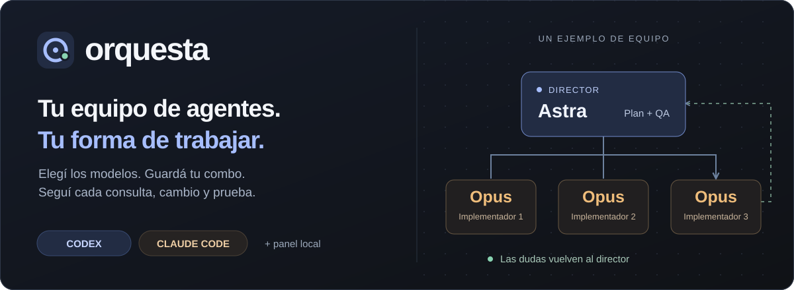
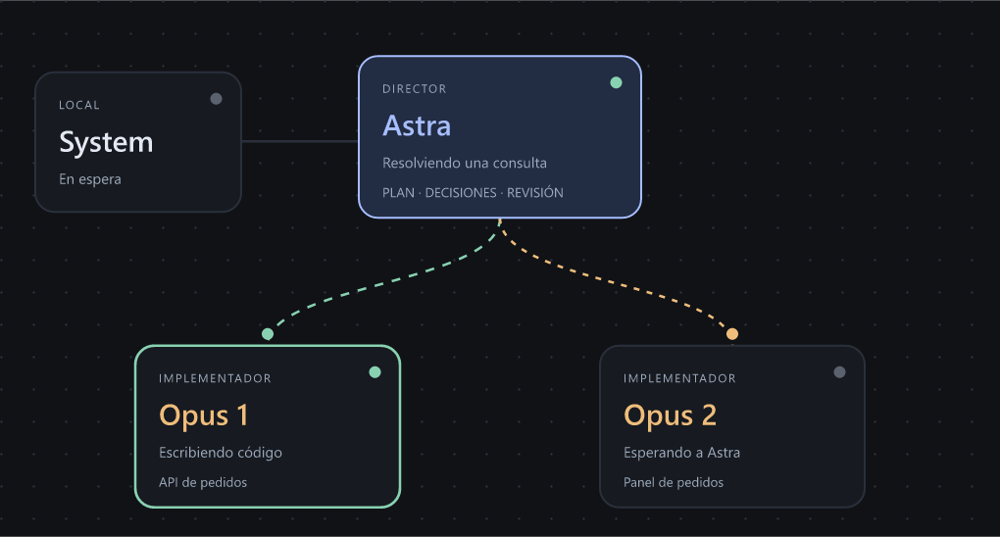
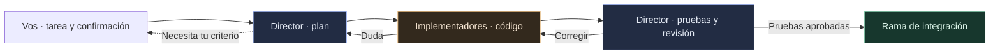

<p align="center">
  
</p>

<p align="center">
  <a href="https://github.com/EmanuelMdz/orquesta/actions/workflows/check.yml"></a>
  <a href="https://github.com/EmanuelMdz/orquesta/tree/v0.2.5"></a>
  <a href="#requisitos"></a>
</p>

<p align="center">
  <strong>Elegí quién dirige. Elegí quién implementa. Mirá al equipo trabajar.</strong><br>
  Desde Codex, Claude Code o tu terminal. Con configuración por proyecto y combos reutilizables.
</p>

<p align="center">
  <a href="#instalar-con-tu-agente"><strong>Copiar para tu agente ↓</strong></a> ·
  <a href="#instalar-con-un-comando">Instalar con un comando</a> ·
  <a href="#ver-a-los-agentes">Ver a los agentes</a> ·
  <a href="docs/USAGE.md">Guía completa</a>
</p>

---

## Instalar con tu agente

**Copiá este bloque con el botón ⧉ de su esquina superior derecha** y pegalo en el chat de Codex o Claude Code. También podés pasarle directamente [el enlace del repositorio](https://github.com/EmanuelMdz/orquesta) y pedirle que siga `INSTALL.md`.

```text
Instalá Orquesta para usarla desde Codex y Claude Code en todos mis proyectos.
Repositorio: https://github.com/EmanuelMdz/orquesta
Leé y seguí: https://raw.githubusercontent.com/EmanuelMdz/orquesta/main/INSTALL.md

Si ya está instalada, comprobá la versión y las skills antes de actualizar.
Verificá las conexiones disponibles sin cambiar mis modelos ni permisos.
Al terminar, indicame cómo abrir el asistente en este proyecto.
No inicies agentes ni modifiques el proyecto durante la instalación.
```

[Instrucciones de instalación para el agente →](INSTALL.md) · [Índice de documentación en texto plano →](llms.txt)

## Instalar con un comando

En una terminal:

```sh
npx --yes --package=git+https://github.com/EmanuelMdz/orquesta.git#v0.2.5 orquesta install
```

Se instala **una vez para tu usuario**, con el asistente disponible en todos tus proyectos. No hace falta clonar Orquesta dentro de cada repo. Repetí el comando para reinstalar esta versión.

### Requisitos

- **Node.js ≥22.13, npm y Git.**
- La CLI oficial de cada proveedor que elijas, con sesión iniciada y acceso al modelo. Las cuentas y las CLI de los proveedores se configuran por separado; `orquesta doctor` comprueba las conexiones.
- Para iniciar una tarea: un repositorio Git con al menos un commit y sin cambios pendientes. Podés configurar el equipo antes de dejarlo limpio.

Las llamadas reales usan las cuentas de tus proveedores y consumen su uso. El panel corre en tu equipo; las solicitudes a los modelos se envían a sus servicios.

<details>
<summary>Windows, comprobaciones y solución de problemas</summary>

Si PowerShell bloquea scripts `.ps1`, usá `npx.cmd` y `orquesta.cmd`. En Windows también se detectan las CLI incluidas en extensiones compatibles de VS Code.

```sh
orquesta --version
orquesta doctor
orquesta install
```

El último comando vuelve a registrar las skills. Reabrí el chat si todavía no aparecen. Si falta un proveedor, podés configurar un equipo con el que sí esté disponible; Orquesta no sustituye modelos automáticamente.

</details>

## Abrilo en cualquier proyecto

Abrí el chat o la terminal **dentro del repositorio donde querés trabajar**:

| Dónde estás | Qué escribís |
| --- | --- |
| Chat de **Codex** | `$orquesta` — también disponible en `/skills` |
| Chat de **Claude Code** | `/orquesta` |
| **Terminal** normal | `orquesta` |

El asistente te guía para **elegir equipo → ajustar implementadores → escribir tarea → confirmar**. El menú del chat usa las preguntas que permite cada cliente; el panel visual se abre en el navegador.

**En Codex, empezá escribiendo `$` y seleccioná `orquesta` de la lista.** También podés buscarla en `/skills`. `/orquesta` corresponde a Claude Code; no es un comando slash de Codex. Si instalaste con el chat abierto, reabrilo. Los accesos anteriores `$orquestar` y `/orquestar` siguen funcionando como alias.

Si preferís escribirlo como una frase, pedí **«Abrí Orquesta en este proyecto y mostrame el menú de equipos»**. La skill permite esa invocación cuando el cliente la detecta.

Podés usar el combo inicial **Astra + Opus**, elegir uno guardado o crear el tuyo:

| Rol | Combo inicial | Responsabilidad |
| --- | --- | --- |
| Director | Astra, desde Codex | Plan, decisiones, pruebas de aceptación y revisión |
| Implementadores | Opus, desde Claude Code | Escribir código y consultar dudas al director |
| Vos | Desde el chat o el panel | Definir la tarea, confirmar y resolver decisiones que necesiten tu criterio |

Los proveedores y modelos se eligen por rol, con **1 a 4 implementadores**. Abrir el asistente desde Claude no obliga a usar Claude como director.

**Guardá tus combos favoritos** y elegí uno como predeterminado para proyectos nuevos. Cada proyecto conserva sus modelos, instrucciones y comandos de pruebas. [Cómo configurar equipos y proyectos →](docs/USAGE.md#combos-y-configuración-por-proyecto)

## Ver a los agentes

El panel muestra **asignaciones, consultas, respuestas, cambios y pruebas** conforme suceden. Podés seleccionar una tarea, inspeccionar su diff, pausar el trabajo y responder cuando el director te consulta.



El mapa permite seleccionar **Astra, System, Opus 1, Opus 2…** para filtrar la conversación. La tarea completa se despliega cuando la necesitás. Los estados, conexiones y tiempos se calculan a partir del registro local: **ver el panel no agrega llamadas ni tokens a los modelos**. Sólo se muestran mensajes que las CLI ya emiten; no se les pide narrar el progreso.

El chat desde el que abrís Orquesta tiene su propia actividad: sus mensajes previos al inicio no forman parte de la ejecución. Si el plan queda bloqueado antes de asignar tareas, el mapa muestra a los implementadores sin comenzar.



**Una duda vuelve al director. Una prueba fallida vuelve a implementación.** Las tareas independientes pueden avanzar en paralelo. La integración queda en una rama de Orquesta para que la revises y la fusiones; no hace push automático del trabajo generado.

Son comunicaciones y acciones observables de los agentes. El panel no muestra razonamiento privado interno ni una terminal completa por modelo.

Las correcciones no tienen un tope fijo: el equipo sigue mientras avance. Si se repiten entregas o problemas, Astra indica un cambio de enfoque; si persiste el estancamiento, se detiene esa tarea conservando el trabajo. El presupuesto de llamadas y la revisión de calidad siguen vigentes. [Cómo se evita una repetición →](docs/USAGE.md#ver-y-controlar-a-los-agentes)

### Probalo sin gastar llamadas

```sh
orquesta demo --ui
```

La demo usa modelos simulados y ejecuta Git y tests reales. Incluye una consulta al director, una prueba fallida y una corrección. Para abrir el panel normal y recuperar la terminal, usá `orquesta launch`.

## Documentación y estado

| Necesitás… | Empezá acá |
| --- | --- |
| Instalar desde un chat o actualizar | [INSTALL.md](INSTALL.md) |
| Configurar repos, combos, pruebas y comandos | [Guía de uso](docs/USAGE.md) |
| Entender el motor y las integraciones | [Arquitectura](docs/ARCHITECTURE.md) |
| Ver qué se probó realmente | [Validación](docs/VALIDATION.md) |
| Darle contexto a otro LLM | [llms.txt](llms.txt) |
| Reportar un problema | [Issues](https://github.com/EmanuelMdz/orquesta/issues) |

**Versión temprana, 0.2.5.** La suite cubre 44 pruebas. GitHub Actions comprueba Windows, Linux y macOS, e instala el paquete en un perfil vacío con caché y configuración propias antes de abrir dos repositorios de prueba. Se validó un circuito real Astra → Opus en Windows; los demás combos tienen pruebas de enrutamiento con CLI simuladas. El acceso a cada modelo depende de tu proveedor.

Los worktrees separan los cambios; las pruebas y la preparación ejecutan código del proyecto. Una caída abrupta o un conflicto de integración puede necesitar revisión manual. [Alcance y límites →](docs/USAGE.md#alcance)

<details>
<summary>Desarrollar Orquesta desde el código fuente</summary>

```sh
git clone https://github.com/EmanuelMdz/orquesta.git
cd orquesta
npm ci
npm test
npm run check
```

`npm run test:live` llama a modelos reales y consume uso de tus cuentas. No forma parte de la suite normal. Los datos locales de ejecución, credenciales y paquetes generados se excluyen de Git.

</details>

---

Hecho por [EmanuelMdz](https://github.com/EmanuelMdz). Orquesta es un proyecto independiente; no está afiliado a OpenAI ni a Anthropic.

Licencia: por definir (`UNLICENSED`).
