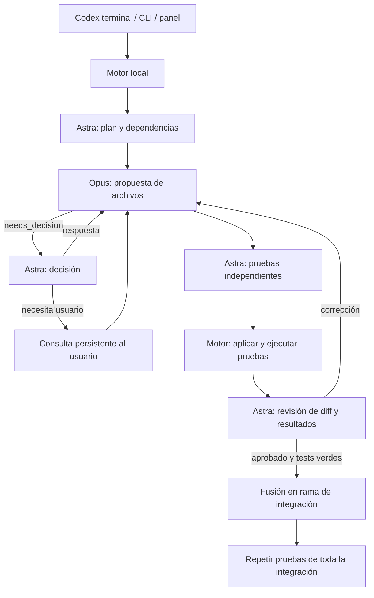

# Arquitectura de Orquesta

## Correcciones sin tope fijo desde 0.2.5

`maxCorrections` se elimina del motor y de los combos; `validateConfig` acepta y descarta el campo antiguo. El contador `attempts` conserva la historia, pero no impide corregir. El presupuesto `maxCalls` sigue siendo un techo de uso de modelos.

La revisión añade `progress` y `nextApproach`, recibe la revisión anterior y el diff de la última corrección. `src/corrections.ts` guarda hasta 12 identidades de contenido Git, hallazgos y comprobaciones fallidas. Detecta entregas repetidas (incluyendo A → B → A), hallazgos iguales sin mejora de comprobaciones y estancamiento declarado por el revisor. La primera señal pide un cambio de enfoque con la revisión ya disponible; otra señal consecutiva detiene esa tarea. No hay una llamada separada de vigilancia ni de replanteo.

La historia y el bloqueo persisten. Reanudar sin nueva evidencia, alcance o código no vuelve a llamar al modelo de esa tarea. Las decisiones humanas y condiciones de ejecución relevantes forman parte de la identidad del contexto. Los cambios de enfoque son instrucciones dentro del alcance existente; no modifican el DAG, las pruebas protegidas ni los criterios de aceptación. La detección semántica depende del revisor y no demuestra ausencia de todos los bucles; el presupuesto de llamadas se conserva como último límite.

## Actividad y respuestas desde 0.2.4

`execute` acepta duración total 0 y un watchdog de inactividad que sólo se renueva cuando el adaptador identifica progreso. Claude emite fragmentos nativos; se guardan metadatos de actividad como máximo cada cinco segundos, sin almacenar razonamiento ni pedir mensajes nuevos. La captura por cola acota la memoria sin cortar por el tamaño acumulado del stream; cada línea mantiene un límite de tamaño. El modelo resuelto se registra desde los eventos de la CLI.

`Engine.answer` modifica la instancia activa del trabajo cuando otro implementador sigue ejecutándose, evitando que una copia persistida sobrescriba decisiones. La pregunta esperada permite rechazar respuestas desactualizadas y reconocer reenvíos idénticos. El panel solicita continuar tras responder; la API conserva el comportamiento de sólo guardar para clientes que omiten `resume`.

## Interrupciones y concurrencia desde 0.2.3

`agentTimeoutMs` limita respuestas de proveedores (20 minutos por defecto); `timeoutMs` sigue limitando comandos y pruebas. Al reanudar, `validateConfig` completa campos nuevos de configuraciones antiguas sin cambiar los ajustes ya presentes. No se introducen reintentos ni llamadas adicionales.

`runAttention` deriva diagnósticos de los errores persistidos y se agrega a la representación pública de cada ejecución. Es una proyección de lectura: no guarda estado ni invoca proveedores. El mapa limita sus puestos a la concurrencia configurada; para eventos antiguos sin `workerId` reconstruye puestos visuales, mientras las tareas sin iniciar permanecen en una cola aparte.

## Actividad visual desde la versión 0.2.2

El motor asigna un `workerId` numérico a cada tarea de un lote y lo copia a los eventos. Los eventos conservan el número histórico aunque una tarea cambie de puesto al reanudarse. Esa información sólo se usa para persistencia y presentación; no se agrega al prompt del proveedor.

El panel dibuja un SVG interactivo a partir de estado y eventos. Agrupa planificación, decisiones y calidad bajo el orquestador; System representa entorno, Git y ejecución de pruebas. Las conexiones activas, estados y reloj se calculan localmente. SSE solicita actualizaciones a intervalos acotados, sin llamadas a modelos. Las CLI reenvían mensajes y consultas ya emitidas; se excluyen razonamiento interno y propuestas JSON completas del chat visible.

## Cambios de la versión 0.2

`src/service.ts` mantiene un servicio local por proyecto con descriptor autenticado y lock de propietario. Las CLI y el MCP reutilizan el servicio activo por HTTP; así las órdenes de ambos clientes llegan al mismo motor y al mismo canal de eventos. `launch` puede iniciarlo en segundo plano, y `stop` pausa y cierra. Un cliente que reutiliza el servicio no lo cierra al terminar.

`src/config.ts` guarda los ajustes locales en `.orquesta/config.json` y registra la exclusión en los metadatos de Git, sin modificar archivos versionados. `src/presets.ts` guarda equipos personales, y el combo predeterminado se aplica a proyectos nuevos. Cada ejecución conserva su propia configuración.

Los proveedores se eligen por rol: `orchestratorProvider` y `implementerProvider`. Los campos históricos `astraModel` y `opusModel` contienen respectivamente el modelo director y el implementador; el transporte ya no depende del nombre interno del rol. El director sigue siendo responsable de decisiones y QA independiente.

`public/settings.js` implementa la configuración visual y los combos. El formulario de tarea muestra equipo y objetivo antes de confirmar. Si cambia la configuración entre la revisión y la confirmación, el servidor exige revisarla de nuevo.

`integrations/orquesta/SKILL.md` contiene el asistente conversacional para ambos chats. `src/integrations.ts` instala copias personales con un helper que apunta al paquete instalado. El postinstall sólo registra skills desde la ubicación global final, nunca desde un checkout temporal de npm. No cambia políticas de aprobación.

Los comandos de preparación del proyecto se ejecutan antes de trabajar en cada worktree. Deben dejar intactos sus archivos versionados. La configuración del framework sigue siendo responsabilidad del proyecto.

El flujo central de implementación, QA y Git se conserva como se describe abajo; Astra/Opus son los modelos del combo inicial.

## Flujo

## Módulos

| Archivo | Responsabilidad |
| --- | --- |
| `src/engine.ts` | Máquina de estados, dependencias, concurrencia, consultas, QA e integración |
| `src/providers.ts` | Protocolos estructurados y streaming de Codex/Claude Code |
| `src/process.ts` | Procesos sin shell, límites, cancelación, entorno y redacción de secretos |
| `src/git.ts` | Worktrees, contexto acotado, commits y fusiones serializadas |
| `src/policy.ts` | Planes válidos, alcance de archivos y protección de rutas |
| `src/schemas.ts` | Contratos JSON de los roles |
| `src/store.ts` | Estado y eventos en SQLite con WAL |
| `src/server.ts` | HTTP local autenticado y eventos SSE |
| `src/mcp.ts` | JSON-RPC por stdio, herramientas que controlan el mismo motor |
| `src/cli.ts` | Comandos de terminal y registro en Codex |
| `src/config.ts` | Configuración, detección de CLI y diagnóstico |
| `src/demo.ts` | Fixture y respuestas simuladas para pruebas sin modelos |
| `public/` | Panel sin framework, contenido de agentes renderizado como texto |

## Invariantes

- Las propuestas de Opus solamente pueden tocar archivos explícitos del plan. La carpeta de QA pertenece a Astra.
- Una consulta no incluye modificaciones: se resuelve antes de pedir la siguiente propuesta.
- Las aprobaciones y resultados se vinculan al commit comprobado. Una aprobación no convierte una prueba fallida en éxito.
- Las tareas con dependencias esperan su integración; tareas con archivos coincidentes no se ejecutan juntas.
- La rama de origen no se modifica. La rama de integración termina en `/integration` para evitar colisiones con los nombres de ramas de tareas.
- Se validan todas las rutas de una propuesta antes de escribir el primer archivo. Esto no garantiza transacciones ante una caída del sistema.
- Los controles de pausa conservan el estado; no se responde automáticamente por el usuario.
- La detección de estancamiento frena correcciones repetidas. Se conservan los límites de llamadas, contexto, consultas y los tiempos configurados.

## Transporte y almacenamiento

La salida estructurada de las CLI se valida antes de aplicarse. Opus usa Claude Code en modo no interactivo sin herramientas; Astra usa `codex exec` en modo de solo lectura. El MCP de Orquesta se desactiva en el Codex hijo para impedir recursión.

SQLite almacena ejecuciones, tareas y eventos bajo `.orquesta`. Los worktrees están bajo `.orquesta/worktrees/<run_id>`. Los tests son comandos configurados por el usuario; el entorno elimina variables de credenciales y las variables de ejecución de tests heredadas que alteraban el comportamiento de `node:test`.

El servidor HTTP usa loopback, validación de Host/Origin, token, CSP y endpoints explícitos. El token llega al panel en el fragmento de URL, se pasa a almacenamiento de sesión y las solicitudes API lo envían por Authorization. El panel consume SSE y puede volver a leer los eventos guardados.

El servidor MCP usa stdio JSON-RPC. No escribe logs de aplicación en stdout. Una llamada de inicio devuelve el ID y deja el motor trabajando; las herramientas de estado y eventos permiten observarlo. Las anotaciones MCP declaran estado/eventos como lectura y diferencian inicio/reanudación, que modifican worktrees y llaman servicios de modelos. Codex conserva su política de aprobación para estas acciones.

Referencias oficiales: [MCP en Codex](https://learn.chatgpt.com/docs/extend/mcp), [modo no interactivo de Codex](https://learn.chatgpt.com/docs/non-interactive-mode) y [Claude Code no interactivo](https://code.claude.com/docs/en/headless).
