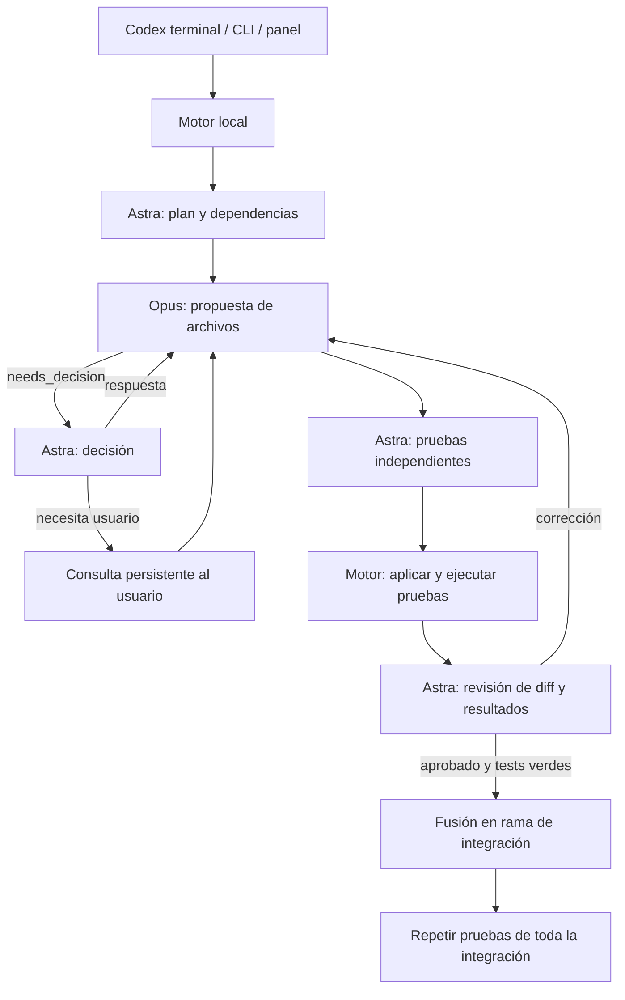

# Arquitectura de Orquesta 0.1

## Flujo

## Módulos

| Archivo | Responsabilidad |
| --- | --- |
| `src/engine.ts` | Máquina de estados, dependencias, concurrencia, consultas, QA e integración |
| `src/providers.ts` | Protocolos estructurados y streaming de Codex/Claude Code |
| `src/process.ts` | Procesos sin shell, límites, cancelación, entorno y redacción de secretos |
| `src/git.ts` | Worktrees, contexto acotado, commits y fusiones serializadas |
| `src/policy.ts` | Planes válidos, alcance de archivos y protección de rutas |
| `src/schemas.ts` | Contratos JSON de los roles |
| `src/store.ts` | Estado y eventos en SQLite con WAL |
| `src/server.ts` | HTTP local autenticado y eventos SSE |
| `src/mcp.ts` | JSON-RPC por stdio, herramientas que controlan el mismo motor |
| `src/cli.ts` | Comandos de terminal y registro en Codex |
| `src/config.ts` | Configuración, detección de CLI y diagnóstico |
| `src/demo.ts` | Fixture y respuestas simuladas para pruebas sin modelos |
| `public/` | Panel sin framework, contenido de agentes renderizado como texto |

## Invariantes

- Las propuestas de Opus solamente pueden tocar archivos explícitos del plan. La carpeta de QA pertenece a Astra.
- Una consulta no incluye modificaciones: se resuelve antes de pedir la siguiente propuesta.
- Las aprobaciones y resultados se vinculan al commit comprobado. Una aprobación no convierte una prueba fallida en éxito.
- Las tareas con dependencias esperan su integración; tareas con archivos coincidentes no se ejecutan juntas.
- La rama de origen no se modifica. La rama de integración termina en `/integration` para evitar colisiones con los nombres de ramas de tareas.
- Se validan todas las rutas de una propuesta antes de escribir el primer archivo. Esto no garantiza transacciones ante una caída del sistema.
- Los controles de pausa conservan el estado; no se responde automáticamente por el usuario.
- Los límites de llamadas, contexto, tiempo, consultas y correcciones frenan bucles indefinidos.

## Transporte y almacenamiento

La salida estructurada de las CLI se valida antes de aplicarse. Opus usa Claude Code en modo no interactivo sin herramientas; Astra usa `codex exec` en modo de solo lectura. El MCP de Orquesta se desactiva en el Codex hijo para impedir recursión.

SQLite almacena ejecuciones, tareas y eventos bajo `.orquesta`. Los worktrees están bajo `.orquesta/worktrees/<run_id>`. Los tests son comandos configurados por el usuario; el entorno elimina variables de credenciales y las variables de ejecución de tests heredadas que alteraban el comportamiento de `node:test`.

El servidor HTTP usa loopback, validación de Host/Origin, token, CSP y endpoints explícitos. El token llega al panel en el fragmento de URL, se pasa a almacenamiento de sesión y las solicitudes API lo envían por Authorization. El panel consume SSE y puede volver a leer los eventos guardados.

El servidor MCP usa stdio JSON-RPC. No escribe logs de aplicación en stdout. Una llamada de inicio devuelve el ID y deja el motor trabajando; las herramientas de estado y eventos permiten observarlo. Las anotaciones MCP declaran estado/eventos como lectura y diferencian inicio/reanudación, que modifican worktrees y llaman servicios de modelos. Codex conserva su política de aprobación para estas acciones.

Referencias oficiales: [MCP en Codex](https://learn.chatgpt.com/docs/extend/mcp), [modo no interactivo de Codex](https://learn.chatgpt.com/docs/non-interactive-mode) y [Claude Code no interactivo](https://code.claude.com/docs/en/headless).
